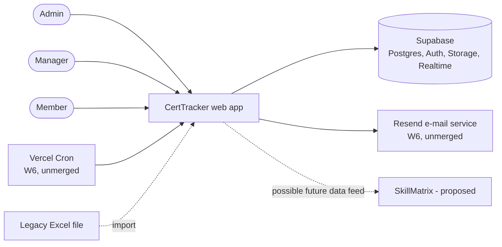
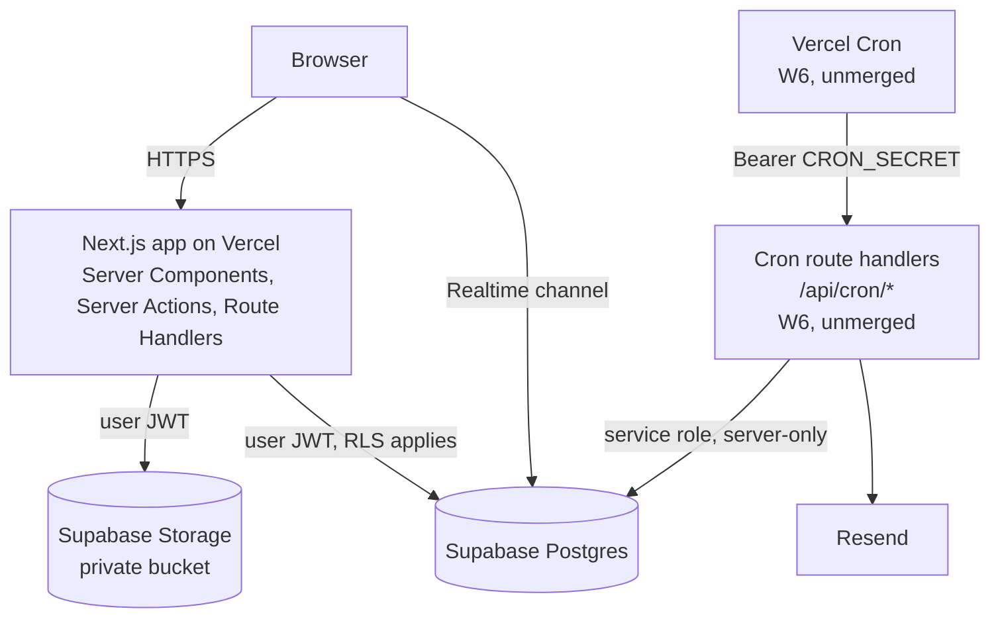
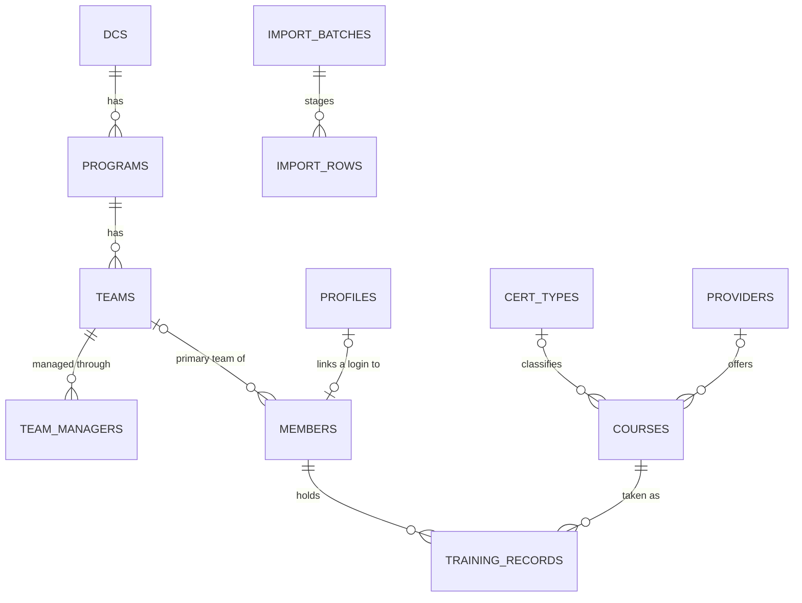

# Software Architecture Document (SAD) — condensed

- **Status:** Draft v1 — condensed from the design spec; backfilled
- **Last updated:** 2026-10-05
- **Owner:** CertTracker team (DC34)
- **Sources:** [Design spec](../superpowers/specs/2026-09-26-certtracker-design.md), [Decisions](../decisions.md), [Design system](../design-system.md), [Free-tier deployment](../deploy/task9-free-tier.md), [E-mail and cron runbook](../deploy/cron-email.md), [Requirements and CA](01-requirements-and-ca.md), [WBS](02-wbs.md)

> **Tóm tắt (VI):** Bản rút gọn kiến trúc từ spec: bối cảnh, container, mô hình dữ liệu, bảo mật, luồng chính, thuộc tính chất lượng, triển khai. Chi tiết và lý do từng lựa chọn nằm ở spec và decisions.md; tài liệu này chỉ trỏ tới. Phần tuần 6 (cron, e-mail, chất lượng dữ liệu) mới có trên nhánh `feat/week6-notifications`, chưa merge vào `dev`; kiến trúc AI (giai đoạn 2) chưa được xây.

**Reading note.** Items marked **(W6, unmerged)** are built on the week-6 branch `feat/week6-notifications` and are not yet merged into `dev` (same label as in [01](01-requirements-and-ca.md) and [02](02-wbs.md)). "Built" means built and tested by the build team, not validated by users.

## 1. Context

Users sign in with e-mail and password; the role (Admin / Manager / Member) decides what they see. External systems: Supabase (data, sign-in, files), Resend (e-mail), Vercel (hosting and scheduler). SkillMatrix is a proposed future consumer; only a compatible data model is kept, nothing is integrated (design spec §1 and §11).

## 2. Containers

| Container | Technology (as in `package.json`) | Responsibility |
|---|---|---|
| Web app | Next.js 16 (App Router), React 19, TypeScript, Tailwind CSS 4 + shadcn/ui, TanStack Table, Recharts, React Hook Form + Zod | Screens, Server Actions (CRUD), import and export route handlers, evidence download (redirect to a short-lived signed link); `src/proxy.ts` refreshes the session and redirects signed-out users |
| Database | Supabase Postgres with Row Level Security | Data, computed expiry (views), permissions, import commit and dashboard functions |
| Sign-in and files | Supabase Auth, Supabase Storage (behind the `FileStorage` interface) | Accounts; evidence files in a private bucket |
| Scheduler and e-mail **(W6, unmerged)** | Vercel Cron (`vercel.json`), Resend + React Email | Weekly expiry alerts and monthly report; sending and history (`notification_log`); data-quality page and notification history in Settings |
| Tests and CI | pgTAP, Vitest, Playwright, GitHub Actions | Permissions, logic, main flows; CI runs lint, type check, unit tests, database tests and a build (end-to-end tests run locally, not in CI) |

Code layout: business code lives in `src/features/<feature>/` (`actions.ts`, `queries.ts`, `schema.ts`, `components/`); pages in `src/app/(app)/`; shared infrastructure in `src/lib/` (`supabase/`, `storage/`, `email/`, `dates.ts`). Features on `dev`: auth, organizations, members, courses, records, import, export, dashboard; **(W6, unmerged)** notifications, data-quality.

## 3. Data model (overview)

Key rules:

- One record per member per course (decisions #15). Expiry date, days to expiry and expiry status are **computed in a view** (`v_training_records`), never stored. Every table has Row Level Security; every view is `security_invoker`.
- Ids are UUIDs; `members.code` (M001) is only a display code. A member has zero or one team, and zero or one login (`profiles.member_id`).
- `team_managers` and `profiles` also reference the Supabase `auth.users` table (not drawn). `import_batches` and `import_rows` are staging tables, visible to Admins only.
- **(W6, unmerged)** `notification_log` (one row per kind, period and recipient; no foreign key) and the view `v_data_quality_issues` are not drawn.
- Details: design spec §4 and `supabase/migrations/`.

## 4. Security

| Concern | Decision |
|---|---|
| Authorisation | Row Level Security is the main layer; user queries always run with the signed-in user's token (decisions #5) |
| Roles | Admin (all), Manager (their teams), Member (own data); helper functions `app_role()`, `my_member_id()`, `managed_team_ids()` (`managed_member_ids()` also exists) |
| Aggregates for everyone | Security-definer functions return numbers only; for Members, groups under 3 learners are hidden, best effort (decisions #30) |
| Personal ranking | Admin / Manager only (decisions #8); `dashboard_ranking()` is security-invoker with a role check (decisions #32) |
| Import commit | `commit_import` is security-invoker and checks the Admin role; no service key (decisions #20) |
| Service role | Only the scheduled-job route handlers (W6, unmerged) may import it; enforced by a lint rule and `server-only` (decisions #35) |
| Scheduled endpoints (W6, unmerged) | `GET` only, `Authorization: Bearer CRON_SECRET`, fail-closed when the secret is missing or too short (decisions #39); only the presence of `dryRun` means a dry run, any other query key is rejected with 400 (decisions #44) |
| Evidence files | Private bucket, type checked by content, 4 MB limit, viewed through short-lived signed links (decisions #7, #17) |
| Dates | All date logic uses `Asia/Ho_Chi_Minh` (`lib/dates.ts`, SQL function `vn_today()`) |
| Secrets | Never committed; `.env.local` is ignored |

## 5. Key flows

**Import from Excel (admin).** Upload → parse and clean in pure functions → staged rows with errors → preview (create / update / skip) → one confirmation runs a single database transaction; a committed batch cannot run twice. Rows with errors are skipped; the commit itself is all-or-nothing. Rules: decisions #20–#29.

**Scheduled e-mail (W6, unmerged).** Vercel Cron calls a route every Monday (expiry alerts) and on day 1 of the month (monthly report) → the route reads a snapshot with the service role → pure planners decide who gets what → for each recipient the database grants an atomic claim → the e-mail is sent → the claim is marked sent or failed. Re-running is safe; a `dryRun` request previews recipients without sending. Rules: decisions #34–#41 and #44; runbook: [cron-email.md](../deploy/cron-email.md) (week-6 runbook; on branch `feat/week6-notifications`, not yet merged into `dev`).

## 6. Quality attributes

| Attribute | Approach | Status |
|---|---|---|
| Security and privacy | RLS tests per role (pgTAP), small-group hiding, no service key in the browser | Built (service-role part: W6, unmerged) |
| Reliability | Import commit is one transaction; e-mails use an atomic claim and a history table | Import: built (W4); e-mails: W6, unmerged |
| Performance | Server rendering; loading state on the Dashboard only (on `dev`). **Known issue, under investigation:** moving between pages feels slow. Candidate causes (function region far from the database, several sequential session calls per navigation, few loading states) are hypotheses and not yet confirmed; see [02](02-wbs.md) §4 | Work package 8.1, not started |
| Accessibility | Contrast checked by an automated test; keyboard and screen-reader use not yet audited | Partial (work package 8.4) |
| Maintainability | Code organised by business feature; decisions logged; tests beside code | Built |
| Language | Vietnamese interface today; English/Vietnamese switch is planned, not designed | Work package 8.2, not started |

## 7. Deployment

The pilot runs on **Vercel Hobby** and **Supabase Free**, Supabase region Tokyo (decisions #13; [deployment notes](../deploy/task9-free-tier.md)). Free-tier limits: Supabase pauses after 7 idle days and has no automatic backups; Vercel Hobby is non-commercial. Every pull request runs lint, type check, unit tests, database tests and a build in GitHub Actions. Migrations reach the cloud database only when pushed manually, so the cloud schema can lag behind the code; this document makes no claim about its current state. Scheduled jobs (W6, unmerged) need Vercel Cron on the production deployment (runbook: [cron-email.md](../deploy/cron-email.md), week-6 runbook on branch `feat/week6-notifications`). Moving the web app to a VPS later only requires calling the same cron URLs from a system scheduler (decisions #39).

## 8. Decisions and known debt

- All recorded decisions with reasons: [decisions.md](../decisions.md). New decisions are appended there.
- Known debt: the e-mail component library `@react-email/components` is deprecated on npm but works (decisions #43); week 6 is not merged into `dev`; the cloud schema is updated manually (see §7); the sending domain is not yet verified on Resend ([00](00-process-status.md) §2).
- **Phase 2 (AI)** is planned, not built, and gated by G1 — see [00](00-process-status.md) §3 and design spec §7.
