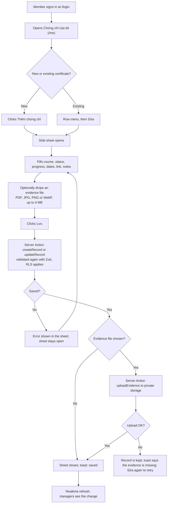
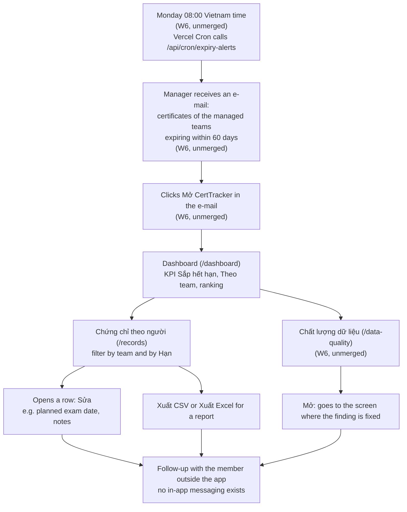
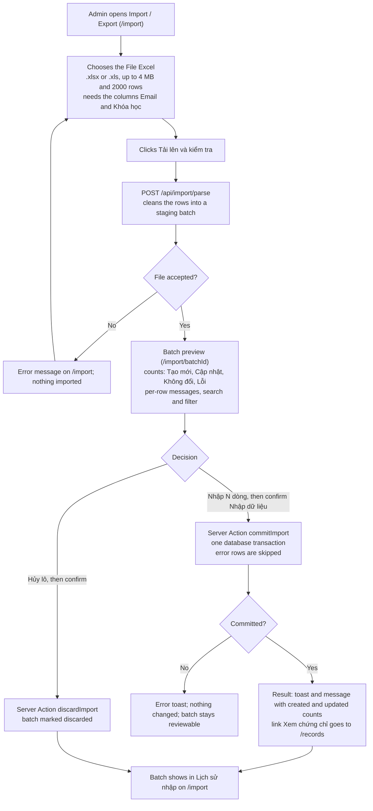

# Design and mockups

- **Status:** Draft v1, part A (as-built documentation). Part B (proposed mockups, §5) is not written yet
- **Last updated:** 2026-10-07
- **Owner:** CertTracker team (DC34)
- **Sources:** [Design system](../design-system.md), [Decisions](../decisions.md), [Requirements and CA](01-requirements-and-ca.md), [WBS](02-wbs.md), [SAD](03-sad.md), the code under `src/app` and `src/components/app-shell/nav.ts`

> **Tóm tắt (VI):** Tài liệu này ghi lại giao diện **đã được xây** (chụp màn hình thật, dữ liệu seed giả) chứ **không** phải mockup: app được xây trước khi có bất kỳ mockup nào được duyệt. Gồm cơ sở thiết kế, bảng liệt kê màn hình theo vai trò và requirement, ba luồng người dùng (member cập nhật chứng chỉ, manager theo dõi hằng tuần, admin import Excel) và thư viện ảnh theo vai trò. Mục 5 (mockup đề xuất cần duyệt **trước khi** xây: phản hồi khi chuyển trang, chuyển ngôn ngữ EN/VI, tự đăng ký có duyệt, ý tưởng AI giai đoạn 2) sẽ được bổ sung ở bản sau.

**Reading note.** Items marked **(W6, unmerged)** are built on the week-6 branch `feat/week6-notifications` and are not yet merged into `dev` (same label as in [01](01-requirements-and-ca.md), [02](02-wbs.md) and [03](03-sad.md)). "Built" means built and tested by the build team, not validated by users.

## 1. Status and how to read this

The screens of CertTracker were **built before any mockup was reviewed**. The usual order (Design/Mockup → PoC → MVP) was not followed for them, as [00](00-process-status.md) explains. This document therefore keeps two kinds of material strictly apart:

- **As-built (§3 and §4, including §4b).** Documentation of what exists today. The images are **screenshots of the running application**, not mockups, and nobody reviewed them as designs before the code was written.
- **Proposed (§5).** Mockups for the changes we want to make next, to be reviewed **before** anything is built. §5 is filled in the next revision of this document.

How the screenshots were made: `docs/process/mockups/capture.mjs` signs in through the real login form as each of the three seed users and captures a 1440 × 900 viewport (and 390 × 844 for the phone views) of a production build running against a freshly reset local database. Consequences for the reader:

- All people, e-mail addresses, courses and numbers are **seed data** (fictional). The three records make charts and tables look sparser than real use would.
- The interface is shown in its current language, Vietnamese. Captions are in English, with the interface text translated in brackets where that helps.
- Each image is a single viewport, so long pages are cut at the bottom. One browser-native control (the file chooser on the import page) shows English text because of the browser, not the application.
- The Settings screenshot reflects a local setup with no e-mail service configured, so its status rows say "not configured" ("Chưa cấu hình").

## 2. Design basis

The design system ([design-system.md](../design-system.md), in Vietnamese) is the reference for every screen; it is not copied here. In short:

- **Direction:** a "certificate file" look (warm paper background, dark teal accent, ink-blue text) with compact data tables, chosen over a "control panel" or a "learning path" look (decision #14). Light theme only.
- **Tokens only:** colours, text sizes and radii are named by role and defined once in `src/app/globals.css`; components never hard-code them, so a dark theme can be added later without touching components.
- **Components:** shadcn/ui (`base-nova`, Base UI) plus CertTracker's own app shell, data table, filter bar, empty state and status components (see the component table in the design system and the `/design` showcase page).
- **Status is never colour alone:** every status has a text label and an icon.
- **Accessibility rules:** text contrast of at least 4.5:1 and control borders, focus rings and meaningful icons at least 3:1, checked by an automated test in CI (`src/app/tokens.test.ts`); keyboard operation, a skip link and landmarks are specified in the design system. A keyboard and screen-reader **audit has not been done** (see [02](02-wbs.md), item 8.4; requirement `NFR-05` is `Partial`).
- **Role-based navigation:** one app shell for every role, with a left sidebar that hides the entries a role cannot use (decision #14, implemented in `src/components/app-shell/nav.ts`). It is a convenience only: access is enforced by Row Level Security.

## 3. Screen inventory

Every `page.tsx` under `src/app`, as of branch `docs/process-pack` (which includes week 6). "Roles" combines the sidebar entries in `nav.ts` with the redirects inside each page. "Status" uses the wording of [01](01-requirements-and-ca.md) §4 and was checked against the first commit that gave the screen its real content (`git log`); the original placeholder pages of 2026-09-27 are ignored.

| Route | Screen | Roles | Purpose | Requirements | Status | Screenshot |
|---|---|---|---|---|---|---|
| `/login` | Sign in | Anyone not signed in | Sign in with e-mail and password (accounts are issued by an admin) | R-17 | Built (W1) | [desktop](images/asbuilt-anon-login.png), [phone](images/asbuilt-anon-login-mobile.png) |
| `/dashboard` | Dashboard | Admin, Manager, Member | KPIs, expiry chart, breakdowns by course, CertType and provider; by team and personal ranking for Admin and Manager only; a Member sees aggregates only, with groups under 3 people hidden | R-09, R-10, R-11, R-18, NFR-02 | Built (W5) | [admin](images/asbuilt-admin-dashboard.png), [manager](images/asbuilt-manager-dashboard.png), [manager ranking](images/asbuilt-manager-dashboard-ranking.png), [member](images/asbuilt-member-dashboard.png) |
| `/me` | My certificates | Admin, Manager, Member, if the account is linked to a member (the seed Admin and Manager are not) | A person's own certificates: add, edit, upload evidence, export | R-05, R-06, R-07, R-08, R-16, R-18 | Built (W3) | [desktop](images/asbuilt-member-me.png), [record editor](images/asbuilt-member-record-editor.png), [phone](images/asbuilt-member-me-mobile.png) |
| `/members` | Members | Admin, Manager (Manager sees only the managed teams; only Admin adds or deletes) | List and maintain members and their team | R-01, R-30 | Built (W2) | [admin](images/asbuilt-admin-members.png) |
| `/records` | Certificates by person | Admin, Manager (a Member is redirected to `/me`) | Team-wide list of certificates with filters, add and edit, evidence, CSV / Excel export | R-05, R-06, R-07, R-08, R-16, R-18 | Built (W3) | [admin](images/asbuilt-admin-records.png), [manager](images/asbuilt-manager-records.png) |
| `/courses` | Courses | Admin, Manager, Member (read); only Admin edits and sees the CertType and provider sections | Course and certificate catalogue: type, provider, level, validity, refund | R-03, R-04 | Built (W2) | [admin](images/asbuilt-admin-courses.png) |
| `/org` | Organisation | Admin (sidebar entry and write controls); the page itself has no role redirect, so what other roles would see is decided by RLS | Centre (DC), Program, Team and team managers | R-02, R-30 | Built (W2) | [admin](images/asbuilt-admin-org.png) |
| `/import` | Import / Export | Admin (others are redirected to `/dashboard`) | Upload the legacy Excel file, export data, list previous import batches | R-15, R-16 | Built (W4) | [admin](images/asbuilt-admin-import.png) |
| `/import/[batchId]` | Import batch preview | Admin (others are redirected to `/dashboard`) | Review the cleaned rows of one batch, then import or discard it | R-15 | Built (W4) | — (a batch exists only after a file is uploaded, which writes data; see the flow in §4 (c)) |
| `/data-quality` | Data quality | Admin, Manager (a Member is redirected to `/me`) | Records and catalogue entries that still need review: exam date passed, done without evidence, member without team, course without validity | R-14 | Built (W6, unmerged) | [admin](images/asbuilt-admin-data-quality.png) |
| `/settings` | Settings | Admin (others are redirected to `/dashboard`) | History of automatic e-mails and whether e-mail is configured | R-12, R-13, R-19, NFR-06 | Built (W6, unmerged) | [admin](images/asbuilt-admin-settings.png) |
| `/design` | Design system showcase | Developers; exists only on the dev server (not found in production) | Shows tokens and components for developers | NFR-05 | Built (W2), dev only | — (not part of the product) |

Notes:

- `src/app/page.tsx` is not a screen: `/` redirects to `/dashboard`, and the proxy sends anyone who is not signed in to `/login`.
- The seed Admin and Manager accounts are not linked to a member record, which is why their sidebar has no "My certificates" entry. A real manager who is also a team member would have one.
- The `/dashboard` row is wider than it looks: the same screen serves three roles and the sections shown change with the role (see the three dashboard images).

## 4. User flows

Each flow was checked against the code: routes, button labels (quoted in Vietnamese as shown on screen) and Server Actions. Steps that exist only on the week-6 branch are marked.

### (a) A member updates a certificate with evidence

Notes: the sheet is opened and closed (without saving) in the [record editor image](images/asbuilt-member-record-editor.png). A Member can add and edit their own records but does not see the company-related fields (via company, refund status) and cannot delete a record; that is hidden in the interface and enforced by RLS.

### (b) A manager's weekly routine

Notes: the Monday time comes from `vercel.json` (`0 1 * * 1`, which is 08:00 in Vietnam) and from the schedule text on the [Settings screen](images/asbuilt-admin-settings.png). The e-mail contains one link back to the application (the root, which leads to the Dashboard). A Manager sees only the managed teams on `/records` and in the ranking, as shown in the [ranking image](images/asbuilt-manager-dashboard-ranking.png). The e-mail step has not been exercised with real recipients, because the sending domain is not verified (see [00](00-process-status.md)).

### (c) An admin imports the legacy Excel file

Notes: the button "Nhập N dòng" is disabled when no row can be imported or when the upload of the batch is incomplete. This flow has **not** been run on the real legacy file (assumption `A-04`); it is covered by automated tests with a generated workbook. The preview and result screens are not in the gallery because producing them requires writing a batch to the database.

## 4b. As-built gallery by role

All images are screenshots of the current application with seed data (see §1).

### Before sign-in

Sign-in page: the only screen shown before a role is known.

### Admin

Admin Dashboard: seven KPI tiles, expiry chart, popular courses and the team breakdown ("Theo team"). Further sections (CertType, provider, personal ranking) are below the first screen.

Members ("Thành viên"): all members with code, team and status; Admin can add and delete.

Certificates by person ("Chứng chỉ theo người"): team-wide list with status, progress, expiry badge and exam date; filters by team, status and expiry; CSV and Excel export.

Courses ("Khóa học"): CertType and provider sections (Admin only) above the course catalogue.

Organisation ("Tổ chức"): centre, program and team lists, each with add, edit and delete.

Import / Export: Excel upload, export links and the (empty) import history. The file chooser text is in English because of the browser.

Data quality ("Chất lượng dữ liệu") **(W6, unmerged)**: one finding in the seed data, a completed certificate without evidence.

Settings ("Cài đặt") **(W6, unmerged)**: e-mail history (empty) and the configuration checklist; on this local setup nothing is configured.

### Manager

Manager Dashboard: the same KPIs as the Admin's; the sidebar has no Organisation, Import or Settings entry.

The same page scrolled down: breakdowns and the personal ranking ("Xếp hạng cá nhân"), limited to the members of the managed team. Members cannot see this section.

Certificates by person for a Manager: only the managed team's records (two of the three seed records).

### Member

Member Dashboard: aggregates only. Groups with fewer than 3 learners are replaced by "Chưa có dữ liệu" ("No data yet"), and there are no team table or ranking.

My certificates ("Chứng chỉ của tôi"): the member's own records, with add and export.

Record editor opened from "Thêm chứng chỉ" ("Add certificate"): course, status, progress, dates, link, notes and the evidence drop zone. Closed without saving.

### Mobile

Sign-in page at 390 px width.

My certificates at 390 px width: the sidebar becomes a drawer, and the table scrolls horizontally (the status column is already cut off). The layout works but was not designed phone-first.

## 5. Proposed mockups (for review before building)

Everything in this section is **proposed**: nothing here is built, and no sponsor decision has approved it. Mockups will be reviewed before any code is written. Sections 5.1 to 5.3 map to the work packages of the same numbers in [02](02-wbs.md); 5.4 is gated by G1 in [00](00-process-status.md).

### 5.1 Loading feedback on page changes (WBS 8.1)

To be added in the next revision of this document.

### 5.2 Interface language switch EN/VI (WBS 8.2)

To be added in the next revision of this document.

### 5.3 Self sign-up with administrator approval (WBS 8.3)

To be added in the next revision of this document.

### 5.4 Phase 2 AI concepts (gated by G1)

To be added in the next revision of this document.

## 6. Review checklist

To be added in the next revision of this document.
