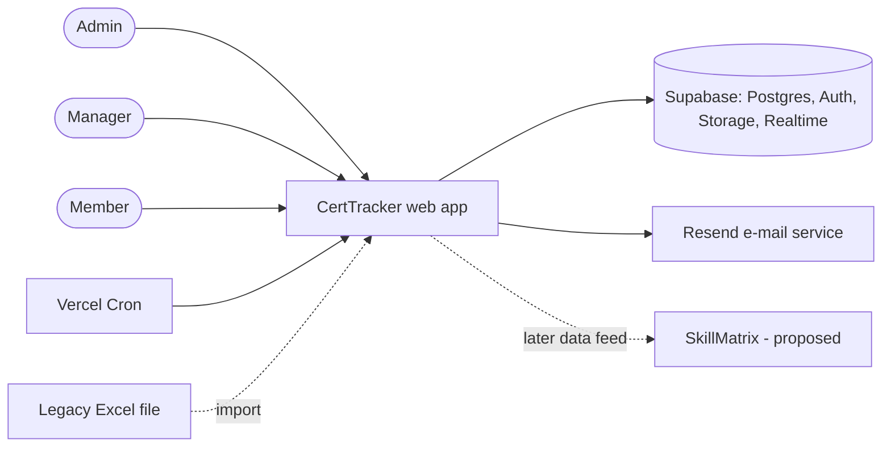
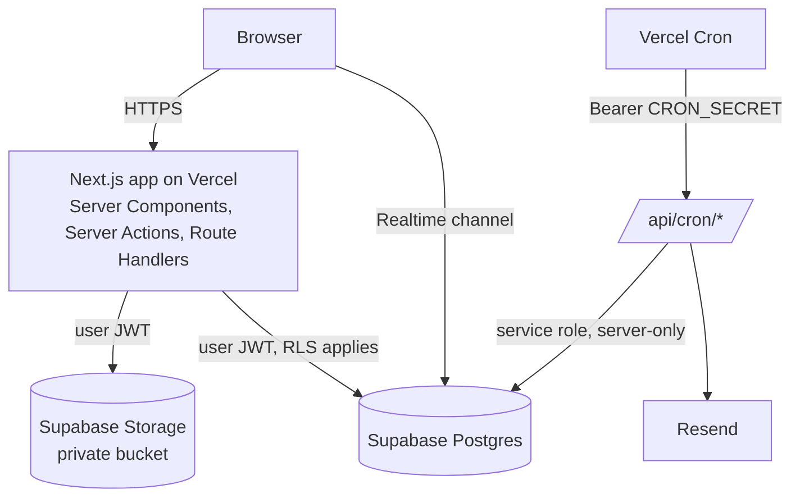
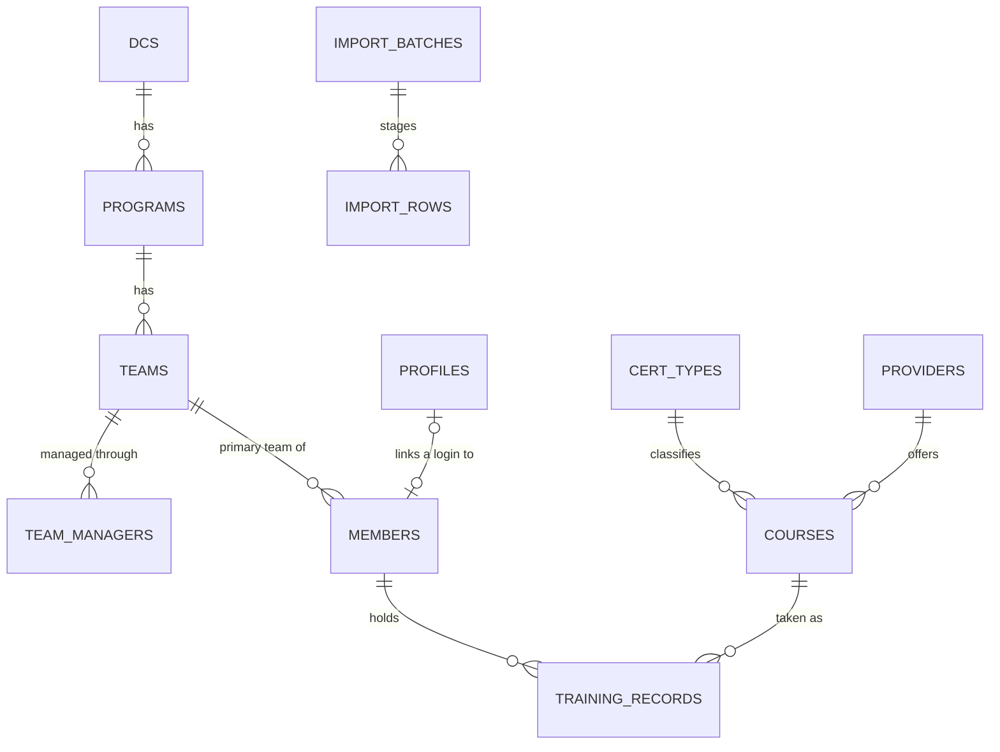

# Bộ tài liệu quy trình (`docs/process/`) Implementation Plan

> **For agentic workers:** REQUIRED SUB-SKILL: Use superpowers:subagent-driven-development (recommended) or superpowers:executing-plans to implement this plan task-by-task. Steps use checkbox (`- [ ]`) syntax for tracking.

**Goal:** Trả lời phản hồi của manager bằng một bộ tài liệu tiếng Anh, trung thực về hiện trạng: process status, Requirements + CA, WBS, SAD gọn, cộng kiểm tra tự động để tài liệu không lệch nhau.

**Architecture:** Bốn tài liệu Markdown trong `docs/process/` (`00`–`03`) + `README.md` làm mục lục. Tài liệu tái dùng nguồn có sẵn (spec, `decisions.md`, plans, git history) thay vì chép lại; mọi requirement có ID và được truy vết sang WBS. Một test Vitest đọc các bảng để bảo đảm ID duy nhất, trạng thái hợp lệ, hai chiều truy vết, link không gãy.

**Tech Stack:** Markdown + Mermaid (hiển thị được trên GitHub), Vitest (kiểm tra nhất quán), git (nguồn số liệu "actual").

**Spec:** `docs/superpowers/specs/2026-10-05-process-docs-and-ux-feedback-design.md` (mục 4 là thiết kế của bộ tài liệu; mục 3 là kết quả spike hiệu năng; mục 5 là quyết định i18n). Nguồn yêu cầu gốc: `CertTracker - Feature List.pdf`, spec `docs/superpowers/specs/2026-09-26-certtracker-design.md`, `docs/decisions.md`.

## Điều kiện tiên quyết

- [ ] Spec ngày 2026-10-05 đã được người dùng duyệt (đã duyệt trong chat).
- [ ] Đã quyết định nền của nhánh: nếu PR tuần 6 (`feat/week6-notifications`) **đã merge vào `dev`** thì tách từ `dev`; nếu chưa, tách từ `feat/week6-notifications` (tài liệu và `decisions.md` dựa vào #34–#44 của tuần 6) và đổi base của PR sau khi tuần 6 merge.
- [ ] Nhánh làm việc: `docs/process-pack`, worktree `.worktrees/docs-process` (thư mục chính đang có thay đổi chưa commit của người dùng — không làm ở đó).

## Global Constraints

- **Tài liệu bằng tiếng Anh**, thuật ngữ kỹ thuật giữ nguyên gốc (Dashboard, Training Record, RLS, Realtime…). Mỗi tài liệu có đoạn **"Tóm tắt (VI)"** 2–4 dòng ngay dưới tiêu đề cho người soạn. Commit message tiếng Anh, Conventional Commits (`docs:`, `test:`).
- **Trung thực, không tô vẽ:** chỗ nào chưa xác nhận ghi `Assumed`; chỗ nào chưa đo ghi "not measured"; không bịa số liệu (effort giờ công **không** được theo dõi → ghi "not tracked", chỉ dùng ngày lịch từ git).
- **Mỗi khẳng định "Built" phải có bằng chứng**: đường dẫn code hoặc test thật tồn tại trong repo tại thời điểm viết (người thực hiện kiểm bằng `ls`/`grep`; không tin plan này một cách mù quáng).
- Tái dùng nguồn: trỏ tới `docs/superpowers/specs/…`, `docs/decisions.md`, `docs/design-system.md`, `docs/deploy/*` bằng link tương đối; không chép nguyên văn nhiều đoạn.
- Mermaid phải hợp lệ (hiển thị được trên GitHub). Không dùng HTML trong Markdown.
- Không đụng vào code ứng dụng; chỉ thêm `docs/process/**`, một test trong `src/lib/`, và cập nhật `docs/decisions.md`, `CLAUDE.md` (bảng "Nguồn sự thật"). Không sửa các quyết định cũ trong `decisions.md` (chỉ thêm dòng mới).
- Chưa được yêu cầu thì không push/PR. Mỗi task commit một lần (cho phép theo plan này).
- Trước khi báo "xong" mỗi task: chạy lệnh kiểm tra của task và nêu kết quả thật (`pnpm lint && pnpm typecheck && pnpm test` cho task có test).

## Quy ước bảng (khóa với test ở Task 5)

**Mã ID:** requirement chức năng `R-01`…`R-99`; phi chức năng `NFR-01`…; giả định `A-01`…; chỉ số thành công `SM-1`…; work package theo cây `1`, `1.1`, `1.2`…

**Bảng requirements (`01`, mục 4):** cột đúng thứ tự `| ID | Requirement | Source | Priority | Build status | Evidence | Validation |`
- `Source` ∈ `FL-1`…`FL-9` (nhóm trong Feature List), `SPEC §x`, `DEC #n`, `MGR` (phản hồi manager), `PROJECT` (đề xuất sau).
- `Priority` ∈ `Must`, `Should`, `Could`.
- `Build status` ∈ `Built (W1)`…`Built (W6)`, `Built (W6, unmerged)`, `Partial`, `Planned`, `Gated (G1)`.
- `Evidence`: một hoặc nhiều đường dẫn trong repo (cách nhau `, `) hoặc `—` (chỉ được dùng khi `Build status` là `Planned` hay `Gated (G1)`).
- `Validation` ∈ `Assumed`, `Decided`, `Validated`.

**Bảng WBS (`02`, mục 2):** cột đúng thứ tự `| WBS | Work package | Deliverable | Acceptance | Planned | Actual | Est. remaining | Depends on | Status | Requirements |`
- `Status` ∈ `Done`, `In progress`, `Not started`, `Blocked (G1)`.
- `Requirements`: các ID `R-xx`/`NFR-xx` cách nhau `, ` hoặc `—`.
- Cổng G1 là một dòng riêng (`WBS` = `G1`, `Status` = `Not started`).

---

## Dữ kiện đã kiểm tra khi viết plan (người thực hiện phải tái kiểm tra bằng lệnh ở từng task)

- Lịch sử git (`origin/dev`): 112 commit, từ 2026-09-26 đến 2026-10-04. PR đã merge: #3 (W1, 09-26), #4/#5 (wrap-up, 09-27), #6 (design system, 09-27), #8 (W2, 09-30), #10 (W3, 10-01), #11 (W4, 10-01), #13 (logo + dropdown, 10-02), #15 (W5, 10-04). Tuần 6: nhánh `feat/week6-notifications` (11 commit, ghi nhận 2026-10-05, chưa merge).
- Số test (nhánh tuần 6): Vitest 542, pgTAP 10 file / 233 assertion, Playwright 39. Trên `dev` (đến tuần 5): Vitest 314, pgTAP 164, e2e 34.
- Hosting: Vercel Hobby (production `https://cert-tracker-three.vercel.app`) + Supabase Free ở Tokyo (`ap-northeast-1`) — `docs/deploy/task9-free-tier.md`, decisions #13. Production hiện chỉ có migration tuần 1; tuần 3–6 chưa `db push` lên cloud (`docs/deploy/migrate-cloud.md`).
- Bối cảnh chiến lược: tài liệu `ai-tool-ideas 2.html` (S+ — "AI Tooling Initiative": AI Analyst, SkillMatrix, FiGen v2) nói SkillMatrix cần một "Employee Skill Repository" và rủi ro chính là **dữ liệu lỗi thời**; CertTracker là nguồn dữ liệu chứng chỉ sạch cho SkillMatrix (spec §1). Không sao chép tài liệu proposal vào repo (file đó chưa được commit).
- Kết quả spike hiệu năng ngày 2026-10-05 (spec mục 3): biên Vercel ở Singapore, `/login` cache 0,26–0,45 s; chưa đo được hàm đã đăng nhập; giả thuyết hàm chạy US East ↔ Supabase Tokyo, ≥3 lần gọi Supabase nối tiếp, thiếu `loading.tsx`.

---

### Task 1: Nhánh làm việc, khung thư mục và `00-process-status.md`

**Files:**
- Create: `docs/process/README.md`, `docs/process/00-process-status.md`

**Interfaces:**
- Produces: thư mục `docs/process/`; quy ước đầu trang tài liệu (xem Step 2); khái niệm **Cổng G1** mà `01`, `02` và `CLAUDE.md` sẽ tham chiếu.

- [ ] **Step 1: Tạo worktree/nhánh**

```bash
git fetch origin
# nếu tuần 6 đã merge vào dev:
git worktree add .worktrees/docs-process -b docs/process-pack origin/dev
# nếu chưa:
# git worktree add .worktrees/docs-process -b docs/process-pack feat/week6-notifications
cd .worktrees/docs-process && git log --oneline -1 && ls docs
```

Expected: có `docs/decisions.md`, `docs/superpowers/specs/2026-10-05-process-docs-and-ux-feedback-design.md` (nếu spec chưa được commit, chép từ thư mục chính: nó đang untracked; spec này **phải** nằm trong nhánh để plan và tài liệu trỏ tới).

- [ ] **Step 2: Quy ước đầu trang (dùng cho cả bốn tài liệu)**

Mỗi tài liệu bắt đầu như sau (thay phần trong `<>`):

```markdown
# <Title>

- **Status:** Draft v1 — backfilled after the MVP build (see `00-process-status.md`)
- **Last updated:** 2026-10-05
- **Owner:** CertTracker team (DC34)
- **Sources:** <danh sách link tương đối tới nguồn dùng>

> **Tóm tắt (VI):** <2–4 dòng tiếng Việt nói tài liệu này để làm gì và điểm cần lưu ý>
```

- [ ] **Step 3: Viết `docs/process/00-process-status.md`**

Nội dung (đủ, không chừa trống; người thực hiện chỉ kiểm lại các dữ kiện bằng lệnh ở Step 4):

````markdown
# Process Status

- **Status:** Draft v1 — backfilled after the MVP build
- **Last updated:** 2026-10-05
- **Owner:** CertTracker team (DC34)
- **Sources:** [Design spec](../superpowers/specs/2026-09-26-certtracker-design.md), [Decisions](../decisions.md), `git log`

> **Tóm tắt (VI):** Đối chiếu chuỗi quy trình của manager với những gì đã làm thật. Dự án đã build MVP nội bộ trước khi có CA và WBS; bộ tài liệu này bù lại và đặt một cổng quyết định (G1) trước Giai đoạn 2 (AI).

## 1. Why this document exists

The recommended process is **Idea → Brainstorm → CA → WBS → SAD → Design/Mockup → PoC → MVP → Production**, with the principle "build the right thing before building the thing right".

CertTracker did **not** follow that order. A feature list (from the DC34 team lead) and a technical design spec existed, and the build started right away. The Concept/Customer Analysis (CA) and the WBS were never written. This document states that plainly, shows where each stage stands today, and defines the gate that stops further investment until the need is confirmed.

## 2. Stage map

| Stage | Status | Evidence / gap |
|---|---|---|
| Idea | Done | `CertTracker - Feature List.pdf` (9 feature groups, DC34) |
| Brainstorm | Done | [Design spec](../superpowers/specs/2026-09-26-certtracker-design.md) (2026-09-26) and [Decisions](../decisions.md) |
| CA (Concept/Customer Analysis) | **Missing — backfilled** | [01-requirements-and-ca.md](01-requirements-and-ca.md). The need was **not** validated with end users |
| WBS | **Missing — backfilled** | [02-wbs.md](02-wbs.md) |
| SAD | Exists as the design spec | [03-sad.md](03-sad.md) condenses it |
| Design / Mockup | Done | [Design system](../design-system.md) and the `/design` page (dev only) |
| PoC | Partial | Foundation deployed 2026-09-27 on free tiers ([deploy notes](../deploy/task9-free-tier.md)); no separate PoC phase was run |
| MVP | Built internally, **not validated** | Weeks 1–6 built in 2026-09-26 → 2026-10-05; the legacy Excel file has not been tried; no UAT with a real team |
| Production | Not started | Vercel Hobby + Supabase Free; cloud database has only the week-1 schema ([migration guide](../deploy/migrate-cloud.md)) |

## 3. Gate G1 — before Phase 2 (AI features, weeks 7–12)

Phase 2 is the largest remaining investment. It is **blocked** until all of these are true:

1. The key assumptions in [01 §7](01-requirements-and-ca.md) (`A-01`…`A-10`) have been checked by interviewing 3–5 real users (1 manager, 1 admin, 2–3 members) and by importing a real Excel file.
2. A real team has used the product for at least two consecutive weeks (including two Monday e-mails) and the sponsor confirms it replaces their spreadsheet.
3. The sponsor confirms which Phase 2 features (`R-20`…`R-26`) are wanted and in what order.

If the interviews show the need is weaker than assumed, the correct outcome is to **stop or re-scope**, not to continue.

## 4. What is next

See [02-wbs.md](02-wbs.md): work packages 1 (requirements and validation), 8 (performance, i18n, sign-up) and 9 (rollout) come before G1.
````

- [ ] **Step 4: Kiểm các dữ kiện trong bảng**

Run (tại worktree):

```bash
git log origin/dev --format='%ad' --date=short | sort | uniq -c       # ngày hoạt động
git log origin/dev --merges --format='%ad|%s' --date=short | head -20   # PR đã merge
ls docs/deploy supabase/migrations | head -30
```

Expected: ngày/ PR khớp mục "Dữ kiện" ở đầu plan. Nếu khác, sửa bảng cho đúng với lệnh (lệnh là nguồn sự thật).

- [ ] **Step 5: Viết `docs/process/README.md` (mục lục)**

```markdown
# CertTracker — Process documents

Read in this order. All four were written **after** the MVP was built; see [00](00-process-status.md) for why and for the gate before Phase 2.

| # | Document | Question it answers |
|---|---|---|
| 00 | [Process status](00-process-status.md) | Where are we in Idea → … → Production, honestly? |
| 01 | [Requirements and CA](01-requirements-and-ca.md) | What problem, for whom, what must it do, how do we know we are right? |
| 02 | [WBS](02-wbs.md) | What work was done and what remains, planned vs actual? |
| 03 | [SAD](03-sad.md) | How is the system built and why? |

Sources of truth that these documents link to rather than copy: the [design spec](../superpowers/specs/2026-09-26-certtracker-design.md), [decisions log](../decisions.md), [design system](../design-system.md), [deployment notes](../deploy/).
```

- [ ] **Step 6: Commit**

```bash
git add docs/process/README.md docs/process/00-process-status.md docs/superpowers/specs/2026-10-05-process-docs-and-ux-feedback-design.md docs/superpowers/plans/2026-10-05-process-docs-pack.md
git commit -m "docs(process): add process index and honest stage map with gate G1"
```

---

### Task 2: `01-requirements-and-ca.md`

**Files:**
- Create: `docs/process/01-requirements-and-ca.md`

**Interfaces:**
- Consumes: bảng quy ước ở đầu plan; Feature List PDF; spec 2026-09-26 (§2, §4, §5, §6, §11); `decisions.md`.
- Produces: ID `R-xx`, `NFR-xx`, `A-xx`, `SM-x` mà Task 3 (WBS) và Task 5 (test) tham chiếu; mục 4 là bảng requirements khóa cột; mục 7 là bảng giả định `A-xx`.

- [ ] **Step 1: Đọc nguồn**

Đọc `CertTracker - Feature List.pdf` (3 trang), spec 2026-09-26 mục 1, 2, 5, 11, 12, `docs/decisions.md`. Với **mỗi** dòng "Built" bên dưới, xác nhận đường dẫn Evidence tồn tại (`ls`/`grep`); sửa Evidence nếu cấu trúc thực tế khác (đừng để đường dẫn sai).

- [ ] **Step 2: Viết tài liệu**

Cấu trúc và nội dung (bảng mục 4 và 7 dưới đây **là** nội dung; chép nguyên rồi chỉnh Evidence theo Step 1):

````markdown
# Requirements and Concept/Customer Analysis (CA)

- **Status:** Draft v1 — backfilled after the MVP build (see `00-process-status.md`)
- **Last updated:** 2026-10-05
- **Owner:** CertTracker team (DC34)
- **Sources:** `CertTracker - Feature List.pdf`, [Design spec](../superpowers/specs/2026-09-26-certtracker-design.md), [Decisions](../decisions.md)

> **Tóm tắt (VI):** Phân tích vấn đề, người dùng, phương án thay thế, danh sách requirement có ID/ưu tiên/trạng thái, chỉ số thành công và các giả định chưa xác nhận kèm kế hoạch kiểm chứng. Điều quan trọng: nhu cầu mới do manager/lead giao, **chưa** được hỏi người dùng cuối.

## 1. Problem statement

Teams in DC34 track employee certifications in Excel / Google Sheets. The expected problems are: data goes stale (nobody updates it), expiring certificates are noticed too late, and a manager cannot get a team-level view without manual work. Every claim in this section is **Assumed** until confirmed by the interviews in §7 (see `A-01`).

Strategic context: CertTracker is built standalone but its data model (Member, Course, Training Record) is designed to feed **SkillMatrix**, a proposed employee-skill repository in the S+ AI Tooling Initiative, whose main risk is stale data (`A-10`).

## 2. Stakeholders and users

| Role | Who | Job to be done |
|---|---|---|
| Sponsor | The manager / lead who commissioned the feature list | Know the team's certification coverage and expiry risk; decide whether to invest further |
| Admin | Person who administers the data (org structure, catalogue, imports, accounts) | Replace the spreadsheet; import legacy data cleanly; keep the catalogue tidy |
| Manager | Leads one or more teams | See who holds / is studying which certificates, get warned before they expire, report monthly |
| Member | Employee | Record own certificates and progress with proof; see own status |

No end user has been interviewed yet (`A-01`, `A-03`).

## 3. Current state and alternatives

| Option | Notes | Status in this project |
|---|---|---|
| Keep Excel / Google Sheets + manual reminders | Zero build cost; the problems in §1 persist | The baseline the product must beat (`SM-1`) |
| Buy / adopt an existing tool | No formal market scan was performed | **Gap** — action `1.4` in the WBS (one-day build-vs-buy scan) |
| Build CertTracker | Chosen at the start (design spec §1–2): cloud SaaS, TypeScript, per-team permissions, clean data for SkillMatrix | Done for the MVP; rationale limited to the spec — re-confirm at gate G1 |

## 4. Requirements

Priority: Must / Should / Could. Validation: `Assumed` (nobody outside the build team confirmed it), `Decided` (a recorded decision by the owner), `Validated` (confirmed by users).

| ID | Requirement | Source | Priority | Build status | Evidence | Validation |
|---|---|---|---|---|---|---|
| R-01 | Manage members: name, email, team, program, DC; auto-generated code (M001) | FL-1 | Must | Built (W2) | src/features/members | Assumed |
| R-02 | Manage DC → Program → Team and assign members to a team | FL-1 | Must | Built (W2) | src/features/organizations | Decided |
| R-03 | Manage the course / certificate catalogue: name, CertType, provider, level, validity (months) | FL-2 | Must | Built (W2) | src/features/courses | Assumed |
| R-04 | Record refund information and a course link | FL-2 | Should | Built (W2) | src/features/courses | Assumed |
| R-05 | Record a certificate per person: planned exam date, issue date, certificate link, via company, refund status | FL-3 | Must | Built (W3) | src/features/records | Assumed |
| R-06 | Track progress % and normalised status (Done / In Progress / Not Started) with notes | FL-3 | Must | Built (W3) | src/features/records | Assumed |
| R-07 | Compute ExpiryDate, DaysToExpiry and ExpiryStatus (Active / Expiring in 60d / Expiring Soon / Expired) | FL-3 | Must | Built (W1) | supabase/migrations/20260928000003_expiry_view.sql | Decided |
| R-08 | Upload evidence files for a record (private storage) | SPEC §6.1 | Should | Built (W3) | src/lib/storage | Assumed |
| R-09 | Dashboard KPIs: members, records, done and completion %, in progress, expired, still valid | FL-4 | Must | Built (W5) | src/features/dashboard | Assumed |
| R-10 | Statistics by team, CertType and provider | FL-4 | Must | Built (W5) | src/features/dashboard | Assumed |
| R-11 | Personal ranking (managers/admins only), course popularity, completion by provider | FL-4 | Should | Built (W5) | src/features/dashboard | Assumed |
| R-12 | Weekly (Monday) e-mail about certificates expiring within 60 days | FL-5 | Must | Built (W6, unmerged) | src/app/api/cron/expiry-alerts | Assumed |
| R-13 | Monthly KPI e-mail to managers (day 1) | FL-5 | Must | Built (W6, unmerged) | src/app/api/cron/monthly-report | Assumed |
| R-14 | Data-quality checks (bad references, status/progress mismatch, bad dates, missing evidence) | FL-5 | Should | Built (W6, unmerged) | supabase/migrations/20261004000001_data_quality_view.sql, src/features/data-quality | Assumed |
| R-15 | Import the legacy Excel with cleaning: normalise status, trim, progress to %, Excel serial dates, de-duplicate members by e-mail | FL-6 | Must | Built (W4) | src/features/import | Assumed |
| R-16 | Export CSV / Excel in UTF-8 (Vietnamese diacritics) | FL-6 | Must | Built (W4) | src/features/export | Assumed |
| R-17 | Sign-in and role-based access (Admin / Manager / Member) enforced by Row Level Security | FL-7 | Must | Built (W1) | supabase/migrations/20260928000004_rls.sql | Decided |
| R-18 | Realtime updates on the records list and the Dashboard | FL-7 | Should | Built (W3) | src/features/records/components/records-realtime.tsx | Assumed |
| R-19 | Scheduled jobs for alerts and periodic reports | FL-7 | Must | Built (W6, unmerged) | vercel.json | Assumed |
| R-20 | AI: Cert Recommendation (next certificate per person, refundable first) | FL-8 | Could | Gated (G1) | — | Assumed |
| R-21 | AI: Training Plan Generator (from a manager goal: who, which cert, timeline, cost) | FL-8 | Could | Gated (G1) | — | Assumed |
| R-22 | AI: Data Assistant (read certificate images/PDF, suggest merging course names, classify CertType/provider) | FL-8 | Could | Gated (G1) | — | Assumed |
| R-23 | AI: Skill Gap Analysis (team certificates vs project needs; key-person risk) | FL-9 | Could | Gated (G1) | — | Assumed |
| R-24 | AI: Completion Risk Prediction (stalled progress, exam date near) | FL-9 | Could | Gated (G1) | — | Assumed |
| R-25 | AI: Insights (Vietnamese commentary on dashboard trends, included in the monthly e-mail) | FL-9 | Could | Gated (G1) | — | Assumed |
| R-26 | AI: Ask Your Data (natural-language questions answered through whitelisted queries) | FL-9 | Could | Gated (G1) | — | Assumed |
| R-27 | AI calls only from the backend; the API key never reaches the browser | FL-9 | Must | Planned | — | Decided |
| R-28 | AI sees only data the user may see (respects RLS) | FL-9 | Must | Planned | — | Decided |
| R-29 | No unnecessary personal data (e-mail, phone) in prompts | FL-9 | Must | Planned | — | Decided |
| R-30 | A member belongs to exactly one team; a manager can manage several teams | DEC #3 | Must | Built (W1) | supabase/migrations/20260928000001_org_and_members.sql | Decided |
| R-31 | Self sign-up with administrator approval (e-mail + password, no SSO) | PROJECT | Could | Planned | — | Assumed |
| NFR-01 | Security: RLS is the main protection; the service-role key is used only by scheduled jobs | SPEC §5 | Must | Built (W6, unmerged) | src/lib/supabase/admin.ts | Decided |
| NFR-02 | Privacy: personal ranking visible to managers/admins only; members see aggregates with small groups hidden | DEC #8 | Must | Built (W5) | supabase/migrations/20261003000001_dashboard_rpc.sql | Decided |
| NFR-03 | Performance: moving between pages feels immediate (loading feedback; target set after re-measuring, see `SM-4`) | MGR | Must | Partial | src/app/(app)/dashboard/loading.tsx | Assumed |
| NFR-04 | Language: the interface can be shown in English or Vietnamese (switch); technical terms stay understandable | MGR | Should | Planned | — | Assumed |
| NFR-05 | Accessibility: text contrast at WCAG AA, keyboard-friendly tables and forms | SPEC §9 | Should | Built (W2) | docs/design-system.md, src/app/tokens.test.ts | Decided |
| NFR-06 | Reliability: scheduled e-mails are never sent twice and failures are visible to the admin | SPEC §12 | Must | Built (W6, unmerged) | src/features/notifications/deliver.ts | Decided |
| NFR-07 | Cost: free-tier hosting during the pilot (Vercel Hobby, Supabase Free); move before commercial use | DEC #13 | Must | Built (W1) | docs/deploy/task9-free-tier.md | Decided |

## 5. Success criteria (measurable)

| ID | Criterion | Target | Basis |
|---|---|---|---|
| SM-1 | A real team stops using its spreadsheet | The sponsor and the admin confirm the spreadsheet is no longer updated for 4 consecutive weeks | Design spec §1 (phase-1 goal) |
| SM-2 | Legacy data imports cleanly | A real file imports with zero unresolved error rows after cleaning; manual fixes recorded | Design spec §10 — *proposed numeric target to confirm with the sponsor* |
| SM-3 | Weekly e-mail works | The Monday e-mail runs correctly on two consecutive Mondays with no failed delivery (Settings history shows Sent > 0, Failed = 0) | Design spec §10 |
| SM-4 | Navigation feels immediate | Moving between pages shows feedback at once and the 75th-percentile page load stays under 1 second — *proposed; confirm after re-measuring with the same method* | Manager feedback (2026-10-05); measurements in `02-wbs.md` item 8.1 |

## 6. Scope

**In scope (phase 1):** R-01 … R-19, R-30, NFR-01 … NFR-07.
**Phase 2 (gated by G1):** R-20 … R-29.
**Planned, not scheduled:** R-31 (self sign-up), NFR-04 (i18n; its own design cycle).
**Out of scope** (design spec §11): a member in several teams, a full audit log, native mobile apps, HRIS / SkillMatrix integration (only a compatible data model is kept).

## 7. Assumptions, risks and the plan to validate them

| ID | Assumption | How to validate | Who | Status |
|---|---|---|---|---|
| A-01 | Teams track certificates in spreadsheets and it is painful (stale data, late expiry warnings) | Interview 3–5 users; look at a real spreadsheet | Sponsor + owner | Assumed |
| A-02 | Managers want the Monday e-mail and will read it | Two Mondays of the pilot; ask for feedback | Owner | Assumed |
| A-03 | Members will update their own progress and evidence | Observe two members doing it; compare update counts during the pilot | Owner | Assumed |
| A-04 | The legacy Excel imports with acceptable effort | Import a real file (week-4 trial); record manual fixes (`SM-2`) | Admin | Assumed |
| A-05 | Storing names and e-mails in a cloud service is acceptable | Recorded in decisions #1; confirm with the data owner before production | Sponsor | Decided |
| A-06 | Showing the personal ranking only to managers/admins is the right privacy trade-off | Ask in the interviews | Owner | Assumed |
| A-07 | Users prefer a Vietnamese interface with English technical terms (or a switch) | Ask in the interviews; input to the i18n design | Owner | Assumed |
| A-08 | The Phase 2 AI features are wanted and in this priority order | Show the list; rank with the sponsor and managers (gate G1) | Sponsor | Assumed |
| A-09 | Data volume stays small (hundreds of members, thousands of records) | Ask for real counts | Admin | Assumed |
| A-10 | SkillMatrix will consume CertTracker data | Confirm with the SkillMatrix owner | Sponsor | Assumed |

**Risks (top five):** (1) the need is weaker than assumed → gate G1; (2) a dirty legacy file → staging and preview in the import, real-file trial; (3) wrong permissions leak data → RLS tests per role; (4) e-mails duplicated or lost → claim log and visible history; (5) slow navigation hurts adoption → performance work package 8.1.

**Interview plan (3–5 people, ~30 minutes each):** one manager, one admin, two or three members. Ask: how do you track certificates today, what went wrong last time, what would make you stop using the spreadsheet, who should see what, which language do you prefer, which of the Phase 2 features would you actually use. Record answers per assumption ID; update this table (Validation → `Validated`) and `00-process-status.md` §3.

## 8. Glossary (EN ↔ VI)

| English term (kept in the UI where marked ✓) | Vietnamese |
|---|---|
| Dashboard ✓ | Bảng điều khiển / tổng quan |
| Training Record ✓ | Bản ghi chứng chỉ của một người |
| CertType ✓ | Loại chứng chỉ |
| Provider ✓ | Nhà cung cấp |
| Expiring Soon / Expiring in 60d / Expired ✓ | Sắp hết hạn (≤ 30 ngày) / Hết hạn trong 60 ngày / Đã hết hạn |
| Evidence | Minh chứng |
| Import / Export ✓ | Nhập / Xuất dữ liệu |
| RLS (Row Level Security) | Phân quyền theo từng dòng dữ liệu |
| Realtime | Cập nhật tức thời |
| Cron job | Tác vụ chạy theo lịch |
````

- [ ] **Step 3: Kiểm tra bằng lệnh**

```bash
# mọi Evidence "Built" phải tồn tại
for p in src/features/members src/features/organizations src/features/courses src/features/records src/features/dashboard src/features/import src/features/export src/features/data-quality src/lib/storage src/lib/supabase/admin.ts src/features/notifications/deliver.ts src/app/api/cron/expiry-alerts src/app/api/cron/monthly-report vercel.json "src/app/(app)/dashboard/loading.tsx" src/features/records/components/records-realtime.tsx docs/design-system.md src/app/tokens.test.ts docs/deploy/task9-free-tier.md supabase/migrations/20260928000003_expiry_view.sql supabase/migrations/20260928000004_rls.sql supabase/migrations/20260928000001_org_and_members.sql supabase/migrations/20261003000001_dashboard_rpc.sql supabase/migrations/20261004000001_data_quality_view.sql; do [ -e "$p" ] && echo "ok  $p" || echo "MISSING $p"; done
```

Expected: không có dòng `MISSING`. Với nhánh chưa chứa tuần 6, các mục `Built (W6, unmerged)` sẽ MISSING — khi đó làm trên nhánh nền tuần 6 (xem điều kiện tiên quyết) hoặc ghi chú rõ trong báo cáo. Sửa Evidence cho khớp thực tế (ví dụ nếu `src/features/export` thực ra nằm chỗ khác).

- [ ] **Step 4: Tự soát nội dung**

Đọc lại: không còn `TBD`; mỗi giả định có "How to validate"; `SM-2`/`SM-4` ghi rõ là *proposed*; không có khẳng định "validated" nào (chưa có người dùng cuối nào xác nhận).

- [ ] **Step 5: Commit**

```bash
git add docs/process/01-requirements-and-ca.md
git commit -m "docs(process): add requirements and CA with traceable IDs"
```

---

### Task 3: `02-wbs.md`

**Files:**
- Create: `docs/process/02-wbs.md`

**Interfaces:**
- Consumes: ID `R-xx`/`NFR-xx` của Task 2; `git log`; spec mục 3 (kết quả spike) và mục 5 (i18n).
- Produces: bảng WBS (cột khóa ở đầu plan); item `8.1` là nơi ghi số đo hiệu năng trước/sau.

- [ ] **Step 1: Lấy số liệu "Actual" từ git (không đoán)**

```bash
git log origin/dev --merges --format='%ad|%s' --date=short | head -20
git log origin/dev --format='%ad' --date=short | sort | uniq -c
git log feat/week6-notifications --format='%ad %s' --date=short -n 12 2>/dev/null
```

Dùng **ngày lịch** và số PR làm "Actual"; effort (giờ công) không được theo dõi nên ghi `not tracked`.

- [ ] **Step 2: Viết tài liệu**

````markdown
# Work Breakdown Structure (WBS)

- **Status:** Draft v1 — backfilled after the MVP build (see `00-process-status.md`)
- **Last updated:** 2026-10-05
- **Owner:** CertTracker team (DC34)
- **Sources:** [Design spec §10](../superpowers/specs/2026-09-26-certtracker-design.md), `git log`, [Plans](../superpowers/plans/)

> **Tóm tắt (VI):** Cây công việc có mã, trạng thái, kế hoạch so với thực tế. "Planned" lấy từ lộ trình tuần 1–6 trong spec; "Actual" lấy từ lịch sử git (ngày lịch; giờ công không được theo dõi). Phần chưa làm là ước lượng khoảng, cần xem lại.

## 1. How to read this

- **Planned**: the roadmap in the design spec (phase 1 = 6 weeks, phase 2 = 6 weeks).
- **Actual**: calendar window from `git log` and merged pull requests. Effort in person-hours was **not tracked**, so none is claimed.
- **Est. remaining**: engineer estimates in working days; ranges, to be reviewed. They are not commitments.
- **Requirements** column links each work package to [01](01-requirements-and-ca.md).
- Phase 1 was built with AI-assisted development, which is why the calendar time is much shorter than the original 6-week plan; the plan was not re-baselined.

## 2. WBS

| WBS | Work package | Deliverable | Acceptance | Planned | Actual | Est. remaining | Depends on | Status | Requirements |
|---|---|---|---|---|---|---|---|---|---|
| 1 | Requirements and project governance | Process documents `00`–`03`, validated assumptions | Documents reviewed by the sponsor; assumptions `A-01`…`A-10` checked | — | 2026-10-05 → | 3–5 days incl. interviews | — | In progress | R-31, NFR-03, NFR-04 |
| 1.1 | Process status, CA, WBS, SAD (this pack) | `docs/process/00`–`03` | Merged; sponsor feedback addressed | — | 2026-10-05 | 1 day | — | In progress | — |
| 1.2 | User interviews | Interview notes per assumption | 3–5 interviews recorded; `01` §7 updated | — | not started | 2–3 days | 1.1 | Not started | — |
| 1.3 | Real-file import trial | Trial report (rows imported, manual fixes) | `SM-2` measured on a real file | — | not started | 0.5–1 day | 5 | Not started | R-15 |
| 1.4 | Build-vs-buy scan | One-page comparison | Sponsor agrees build is still justified | — | not started | 1 day | 1.1 | Not started | — |
| 2 | Foundation (W1) | Schema, RLS, sign-in, CI, deployment | PRs #3–#5 merged; pgTAP RLS green | Week 1 | 2026-09-26 → 2026-09-27 | — | — | Done | R-07, R-17, R-30, NFR-07 |
| 2.5 | Design system | Tokens, components, `/design` page | PR #6 merged | Week 1–2 | 2026-09-27 | — | 2 | Done | NFR-05 |
| 2.6 | UI polish (logo, favicon, dropdown fixes) | PR #13 | Merged | — | 2026-10-02 | — | 2.5 | Done | NFR-05 |
| 3 | Org and catalogue CRUD (W2) | Organisation, members, courses | PR #8 merged | Week 2 | 2026-09-29 → 2026-09-30 | — | 2 | Done | R-01, R-02, R-03, R-04 |
| 4 | Training Records (W3) | List, form, evidence upload, expiry badge, Realtime | PR #10 merged | Week 3 | 2026-09-30 → 2026-10-01 | — | 3 | Done | R-05, R-06, R-08, R-18 |
| 5 | Import / Export (W4) | Excel import with staging and preview; CSV/Excel export | PR #11 merged; real-file trial pending (1.3) | Week 4 | 2026-10-01 | — | 4 | Done | R-15, R-16 |
| 6 | Dashboard (W5) | KPIs, breakdowns, ranking | PR #15 merged | Week 5 | 2026-10-04 | — | 4 | Done | R-09, R-10, R-11, NFR-02 |
| 7 | Cron, e-mail and data quality (W6) | Expiry alerts, monthly report, notification log, data-quality page | Branch `feat/week6-notifications` reviewed; e2e green | Week 6 | 2026-10-04 → 2026-10-05 | 0.5 day to merge and push migrations | 4, 6 | In progress | R-12, R-13, R-14, R-19, NFR-01, NFR-06 |
| 8 | Cross-cutting improvements | See 8.1–8.3 | — | — | — | — | — | Not started | — |
| 8.1 | Page-navigation performance | Measured before/after; region set near the database; loading feedback on every page; fewer sequential auth calls | `SM-4` met on the same measurement method | — | Diagnosed 2026-10-05 (spike) | 0.5–1 day | 6 | Not started | NFR-03 |
| 8.2 | Interface language switch (EN/VI) | Own design spec → plan → build | Both languages complete; e-mails follow the recipient's language | — | not started | 4–7 days (needs its own design) | 1.1 | Not started | NFR-04 |
| 8.3 | Self sign-up with approval | Own design + build | A new user can request access and an admin approves | — | not started | 2–4 days | 6 | Not started | R-31 |
| 9 | Validation and rollout | See 9.1–9.4 | — | — | — | — | — | Not started | — |
| 9.1 | Push migrations and verify the sending domain | Cloud schema up to date; e-mail domain verified | Production shows all pages; a test e-mail is delivered | — | not started | 0.5–1 day | 7 | Not started | R-12, R-13 |
| 9.2 | Pilot with one real team | Two Mondays of e-mails; feedback | `SM-3` met; feedback recorded | — | not started | 2 calendar weeks | 9.1, 1.3 | Not started | R-12, R-13 |
| 9.3 | Production hosting decision | Decision record: stay on free tiers or move (e.g. VPS) | Recorded in `decisions.md` | — | not started | 1–2 days | 9.2 | Not started | NFR-07 |
| G1 | Gate: need confirmed | Sponsor sign-off that `00` §3 conditions are met | Written decision to open or stop Phase 2 | — | — | — | 1.2, 1.3, 9.2 | Not started | — |
| 10 | Phase 2 — AI features | Weeks 7–12 of the design spec | Re-estimated after G1 | Weeks 7–12 | — | re-estimate after G1 | G1 | Blocked (G1) | R-20, R-21, R-22, R-23, R-24, R-25, R-26, R-27, R-28, R-29 |

## 3. Planned vs actual (summary)

| | Planned | Actual |
|---|---|---|
| Phase 1 (weeks 1–6) | 6 weeks | 2026-09-26 → 2026-10-05 (about 10 calendar days, AI-assisted) |
| Pull requests merged | — | 9 (#3, #4, #5, #6, #8, #10, #11, #13, #15 — see git history); week 6 is on a branch |
| Automated tests (week-6 branch) | — | 542 unit, 233 database, 39 end-to-end |

Caveat: being ahead of the original calendar says nothing about whether the right thing was built. That is what gate G1 and work packages 1.2, 1.3 and 9.2 check.

## 4. Performance measurements (work package 8.1)

Spike on 2026-10-05 (read-only):

| Item | Result |
|---|---|
| Edge location | Singapore (`x-vercel-id: sin1::…`) |
| `/login` (cached) | 0.26–0.45 s (occasionally 1.2–1.9 s on a cold connection) |
| Redirect for a signed-out user | about 0.25 s |
| Function region for signed-in pages | not measured — hypothesis: US East while the database is in Tokyo |
| Sequential Supabase calls per navigation | at least 3 (proxy session check, layout session check + profile read, page query) — from code |
| Pages with a loading state | Dashboard only (before week 6; week 6 adds the data-quality page) |

After the fix, repeat the same measurements and add a "after" column here.
````

- [ ] **Step 3: Kiểm tra số liệu**

Đối chiếu từng ngày/PR trong bảng với lệnh ở Step 1 (PR #3, #4, #5, #6, #8, #10, #11, #13, #15; tổng ghi trong mục 3 phải **đếm đúng số PR liệt kê** — nếu liệt kê 9 PR thì ghi 9). Sửa mọi chỗ lệch. Kiểm số test bằng kết quả chạy thật nếu có thể (`pnpm test`, `pnpm test:db` trên nhánh nền) hoặc trích từ báo cáo tuần 6; nếu không kiểm được, ghi "as reported at the end of week 6".

- [ ] **Step 4: Commit**

```bash
git add docs/process/02-wbs.md
git commit -m "docs(process): add WBS with planned vs actual and gate G1"
```

---

### Task 4: `03-sad.md`

**Files:**
- Create: `docs/process/03-sad.md`

**Interfaces:**
- Consumes: spec 2026-09-26 (§3–§8, §12), `decisions.md`, `docs/deploy/*`, code structure thực tế (`src/`, `supabase/`).
- Produces: SAD gọn (3–4 trang) có 3 sơ đồ Mermaid (context, container, data model).

- [ ] **Step 1: Đọc nguồn và kiểm cấu trúc thật**

```bash
sed -n 1,140p docs/superpowers/specs/2026-09-26-certtracker-design.md
ls src src/app "src/app/(app)" src/features src/lib supabase/migrations
```

Chỉ mô tả những gì đã tồn tại; thành phần chưa có (AI) ghi rõ "Phase 2, not built".

- [ ] **Step 2: Viết tài liệu**

````markdown
# Software Architecture Document (SAD) — condensed

- **Status:** Draft v1 — condensed from the design spec; backfilled
- **Last updated:** 2026-10-05
- **Owner:** CertTracker team (DC34)
- **Sources:** [Design spec](../superpowers/specs/2026-09-26-certtracker-design.md), [Decisions](../decisions.md), [Design system](../design-system.md), [Deployment notes](../deploy/)

> **Tóm tắt (VI):** Bản rút gọn kiến trúc từ spec: bối cảnh, container, mô hình dữ liệu, bảo mật, luồng chính, thuộc tính chất lượng, triển khai. Chi tiết và lý do từng lựa chọn nằm ở spec và decisions.md; tài liệu này chỉ trỏ tới.

## 1. Context



Users sign in with e-mail and password; the role (Admin / Manager / Member) decides what they see. External systems: Supabase (data, sign-in, files), Resend (e-mail), Vercel (hosting and scheduler). SkillMatrix is a future consumer; only a compatible data model is kept (design spec §11).

## 2. Containers



| Container | Technology | Responsibility |
|---|---|---|
| Web app | Next.js (App Router), TypeScript, Tailwind + shadcn/ui, TanStack Table, Recharts, React Hook Form + Zod | Screens, Server Actions (CRUD), import/export, Route Handlers |
| Database | Supabase Postgres with Row Level Security | Data, computed expiry (views), permissions |
| Sign-in and files | Supabase Auth, Supabase Storage | Accounts; evidence files in a private bucket |
| Scheduler and e-mail | Vercel Cron, Resend + React Email | Weekly alerts and monthly report; sending and history |
| Tests and CI | pgTAP, Vitest, Playwright, GitHub Actions | Permissions, logic, main flows |

## 3. Data model (overview)



Key rules: one record per member per course; expiry date, days to expiry and expiry status are **computed in a view**, never stored; every table has Row Level Security; ids are UUIDs and `members.code` (M001) is only a display code. Details: design spec §4 and the migrations in `supabase/migrations/`.

## 4. Security

| Concern | Decision |
|---|---|
| Authorisation | Row Level Security is the main layer; user queries always run with the signed-in user's token |
| Roles | Admin (all), Manager (their teams), Member (own data); helper functions `app_role()`, `my_member_id()`, `managed_team_ids()` |
| Aggregates for everyone | Security-definer functions return numbers only; small groups are hidden for members (decisions #30–#33) |
| Personal ranking | Admin/Manager only (decisions #8) |
| Service role | Only the scheduled-job route handlers may import it; enforced by a lint rule and `server-only` (decisions #35) |
| Scheduled endpoints | `Authorization: Bearer CRON_SECRET`, fail-closed when the secret is missing (decisions #39) |
| Secrets | Never committed; `.env.local` is ignored |

## 5. Key flows

**Import from Excel (admin).** Upload → parse and clean in pure functions → staged rows with errors → preview (create / update / skip) → one confirmation runs a single database transaction; a committed batch cannot run twice. Rules: decisions #20–#29.

**Scheduled e-mail.** Vercel Cron calls a route every Monday and on day 1 → the route reads a snapshot with the service role → pure planners decide who gets what → for each recipient the database grants an atomic claim → the e-mail is sent → the claim is marked sent or failed. Re-running is safe; `dryRun` previews recipients. Rules: decisions #34–#44; runbook: [cron-email.md](../deploy/cron-email.md).

## 6. Quality attributes

| Attribute | Approach | Status |
|---|---|---|
| Security and privacy | RLS tests per role, small-group hiding, no service key in the browser | Built |
| Reliability | Atomic claim and history for e-mails; import is all-or-nothing | Built (e-mails: week 6, unmerged) |
| Performance | Server rendering, loading states. **Known issue:** page navigation is slow (spike 2026-10-05: functions probably run far from the database; sequential session calls; missing loading states) | Work package 8.1 |
| Accessibility | Contrast tests in CI, keyboard-friendly components | Built |
| Maintainability | Code organised by business feature; decisions logged; tests beside code | Built |
| Language | Vietnamese interface today; English/Vietnamese switch planned | Work package 8.2 |

## 7. Deployment

Production runs on **Vercel Hobby** and **Supabase Free** (Tokyo) for the pilot (decisions #13). Every pull request runs lint, type check, unit tests, database tests and a build in GitHub Actions. The cloud database must receive new migrations explicitly (`docs/deploy/migrate-cloud.md`). Moving the web app to a VPS later only requires calling the same cron URLs from a system scheduler.

## 8. Decisions and known debt

- All recorded decisions with reasons: [decisions.md](../decisions.md). New decisions are appended there.
- Known debt: the e-mail component library is deprecated on npm but works (recorded in decisions); the cloud database lags behind the code (weeks 3–6 migrations not yet pushed); Phase 2 (AI) architecture in design spec §7 is a plan, not built.
````

- [ ] **Step 3: Kiểm tra**

- Mermaid: dán từng khối vào https://mermaid.live hoặc chạy `pnpm dlx @mermaid-js/mermaid-cli -i <file>` (nếu cài được trong thời gian hợp lý; không `pnpm add` vào repo) để chắc cú pháp hợp lệ; nếu không kiểm được, soát tay (không dùng ký tự `(`/`)` trong nhãn node không được bao bởi `[...]`).
- Link tương đối: `docs/deploy/cron-email.md` tồn tại chỉ trên nhánh tuần 6; nếu nền là `dev` chưa có tuần 6, bỏ link đó hoặc trỏ tới `../deploy/migrate-cloud.md`.
- Số quyết định (#13, #8, #20–#29, #30–#33, #34–#44) khớp `decisions.md` của nhánh nền; chỉnh nếu lệch.

- [ ] **Step 4: Commit**

```bash
git add docs/process/03-sad.md
git commit -m "docs(process): add condensed SAD with context, container and data diagrams"
```

---

### Task 5: Kiểm tra nhất quán tự động

**Files:**
- Create: `src/lib/process-docs.test.ts`

**Interfaces:**
- Consumes: `docs/process/01-requirements-and-ca.md` (bảng mục 4), `docs/process/02-wbs.md` (bảng mục 2), `docs/process/*.md` (link), quy ước bảng ở đầu plan.
- Produces: test chạy trong `pnpm test` (Vitest chỉ nhận `src/**/*.test.ts`).

- [ ] **Step 1: Viết test (đỏ nếu tài liệu lệch quy ước)**

```ts
import { existsSync, readFileSync, readdirSync } from "node:fs";
import { dirname, resolve } from "node:path";
import { describe, expect, it } from "vitest";

const ROOT = process.cwd();
const DIR = resolve(ROOT, "docs/process");
const read = (name: string) => readFileSync(resolve(DIR, name), "utf8");

/** Rows of the first Markdown table whose header starts with `firstHeader`. */
function tableRows(markdown: string, firstHeader: string): string[][] {
  const lines = markdown.split(/\r?\n/);
  const start = lines.findIndex((l) => l.startsWith(`| ${firstHeader} |`));
  if (start < 0) throw new Error(`table starting with "${firstHeader}" not found`);
  const rows: string[][] = [];
  for (let i = start + 2; i < lines.length && lines[i].startsWith("|"); i += 1) {
    rows.push(lines[i].split("|").slice(1, -1).map((c) => c.trim()));
  }
  return rows;
}

const requirements = tableRows(read("01-requirements-and-ca.md"), "ID").filter((r) => /^(R|NFR)-\d+$/.test(r[0]));
const wbs = tableRows(read("02-wbs.md"), "WBS");

const SOURCE = /^(FL-[1-9]|SPEC §\S+|DEC #\d+|MGR|PROJECT)$/;
const PRIORITY = new Set(["Must", "Should", "Could"]);
const BUILD = /^(Built \(W[1-6]\)|Built \(W6, unmerged\)|Partial|Planned|Gated \(G1\))$/;
const VALIDATION = new Set(["Assumed", "Decided", "Validated"]);
const WBS_STATUS = new Set(["Done", "In progress", "Not started", "Blocked (G1)"]);

describe("01-requirements-and-ca.md", () => {
  it("has requirements and unique ids", () => {
    expect(requirements.length).toBeGreaterThan(20);
    const ids = requirements.map((r) => r[0]);
    expect(new Set(ids).size).toBe(ids.length);
  });

  it.each(requirements)("%s uses only allowed vocabulary", (id, _text, source, priority, build, evidence, validation) => {
    expect(source, `${id} source`).toMatch(SOURCE);
    expect(PRIORITY.has(priority), `${id} priority`).toBe(true);
    expect(build, `${id} build status`).toMatch(BUILD);
    expect(VALIDATION.has(validation), `${id} validation`).toBe(true);
    // Only requirements that are not built yet may have no evidence.
    if (evidence === "—") expect(build, `${id} has no evidence but claims to be built`).toMatch(/^(Planned|Gated \(G1\))$/);
  });

  it("every piece of evidence points at something that exists on this branch unless it is flagged as unmerged", () => {
    for (const row of requirements) {
      const [id, , , , build, evidence] = row;
      if (evidence === "—" || build.includes("unmerged")) continue;
      for (const path of evidence.split(", ")) {
        expect(existsSync(resolve(ROOT, path)), `${id}: ${path} does not exist`).toBe(true);
      }
    }
  });

  it("no requirement claims to be Validated without a recorded interview (none have been done yet)", () => {
    expect(requirements.filter((r) => r[6] === "Validated").map((r) => r[0])).toEqual([]);
  });
});

describe("02-wbs.md", () => {
  it("has the gate and valid statuses", () => {
    expect(wbs.some((r) => r[0] === "G1")).toBe(true);
    for (const r of wbs) expect(WBS_STATUS.has(r[8]), `${r[0]} status "${r[8]}"`).toBe(true);
  });

  it("has unique work-package codes", () => {
    const codes = wbs.map((r) => r[0]);
    expect(new Set(codes).size).toBe(codes.length);
  });

  it("traces both ways: every requirement is in a work package and every referenced id exists", () => {
    const known = new Set(requirements.map((r) => r[0]));
    const referenced = new Set<string>();
    for (const row of wbs) {
      const cell = row[9];
      if (cell === "—") continue;
      for (const id of cell.split(", ")) {
        expect(known.has(id), `WBS ${row[0]} references unknown ${id}`).toBe(true);
        referenced.add(id);
      }
    }
    const missing = [...known].filter((id) => !referenced.has(id));
    expect(missing, `requirements not covered by any work package: ${missing.join(", ")}`).toEqual([]);
  });

  it("blocks Phase 2 behind gate G1", () => {
    const phase2 = wbs.find((r) => r[0] === "10");
    expect(phase2?.[8]).toBe("Blocked (G1)");
    expect(phase2?.[7]).toContain("G1");
  });
});

describe("process documents", () => {
  const files = readdirSync(DIR).filter((f) => f.endsWith(".md"));

  it("contains the expected files", () => {
    expect(files).toEqual(expect.arrayContaining(["README.md", "00-process-status.md", "01-requirements-and-ca.md", "02-wbs.md", "03-sad.md"]));
  });

  it.each(files)("%s: relative links resolve and has a Vietnamese summary", (file) => {
    const text = read(file);
    for (const [, target] of text.matchAll(/\]\((?!https?:|#|mailto:)([^)\s]+)\)/g)) {
      const path = target.split("#")[0];
      if (!path) continue;
      expect(existsSync(resolve(dirname(resolve(DIR, file)), path)), `${file} → ${target}`).toBe(true);
    }
    if (file !== "README.md") expect(text).toContain("**Tóm tắt (VI):**");
  });

  it("03-sad.md has the three mermaid diagrams (context, container, data model)", () => {
    const sad = read("03-sad.md");
    expect((sad.match(/```mermaid/g) ?? []).length).toBe(3);
  });
});
```

Ghi chú: các đường dẫn Evidence của dòng `Built (W6, unmerged)` được bỏ qua kiểm tra tồn tại (nhánh nền có thể chưa chứa tuần 6); khi tuần 6 merge, đổi nhãn thành `Built (W6)` và test sẽ bắt đầu kiểm chúng.

- [ ] **Step 2: Chạy**

Run: `pnpm exec vitest run src/lib/process-docs.test.ts`
Expected: PASS. Nếu FAIL, **sửa tài liệu** (không nới test): ID trùng, từ vựng sai, requirement không có work package, link gãy, Evidence trỏ file không tồn tại. Báo trong kết quả những chỗ đã sửa.

- [ ] **Step 3: Mutation-check bằng tay (rồi hoàn tác)**

Thử lần lượt: (a) đổi `Priority` của một dòng thành `Critical`; (b) xóa `R-10` khỏi mọi ô Requirements trong WBS; (c) đổi một link thành `(03-sadx.md)`; (d) đổi `Blocked (G1)` của dòng 10 thành `Not started`. Mỗi lần test phải FAIL; sau đó hoàn tác (`git checkout -- docs/process`).

- [ ] **Step 4: Chạy bộ kiểm chung**

Run: `pnpm lint && pnpm typecheck && pnpm test`
Expected: xanh (số Vitest = baseline + test mới).

- [ ] **Step 5: Commit**

```bash
git add src/lib/process-docs.test.ts
git commit -m "test(docs): keep requirements, WBS and links consistent"
```

---

### Task 6: Quyết định, `CLAUDE.md`, bản trả lời manager, bàn giao

**Files:**
- Modify: `docs/decisions.md`, `CLAUDE.md` (chỉ bảng "Nguồn sự thật"), `docs/superpowers/specs/2026-10-05-process-docs-and-ux-feedback-design.md` (cập nhật dòng trạng thái)

**Interfaces:**
- Consumes: spec mục 6.1 (bốn quyết định); số quyết định cuối trong `decisions.md`.

- [ ] **Step 1: Thêm bốn dòng vào `docs/decisions.md`**

Đọc phần cuối bảng để biết số cuối (ví dụ #44 nếu nền chứa tuần 6) và tiếp số kế. Định dạng 4 cột, ngày `2026-10-05`, không sửa dòng cũ:

| # | Ngày | Quyết định | Lý do / phương án đã loại |
|---|---|---|---|
| (số kế) | 2026-10-05 | Dự án dùng chuỗi **Idea → Brainstorm → CA → WBS → SAD → Design/Mockup → PoC → MVP → Production** làm khung quy trình. Vì đã build trước, CA, WBS và SAD rút gọn được **viết bù** trong `docs/process/` | Phản hồi của manager: tránh tốn công vào thứ không giải quyết nhu cầu thật. Loại bỏ việc "chỉ trả lời bằng lời" vì không để lại bằng chứng |
| (số kế + 1) | 2026-10-05 | **Cổng G1:** Giai đoạn 2 (AI) chỉ mở khi các giả định then chốt đã được xác nhận bằng phỏng vấn 3–5 người dùng, đã chạy file Excel thật, và một team thật dùng ít nhất hai tuần liền (gồm hai email thứ Hai) | Giai đoạn 2 là khoản đầu tư lớn nhất; nhu cầu hiện mới do manager giao, chưa hỏi người dùng cuối |
| (số kế + 2) | 2026-10-05 | Tài liệu quy trình viết bằng **tiếng Anh**, nằm ở `docs/process/`, mở đầu bằng tóm tắt tiếng Việt; thuật ngữ kỹ thuật giữ nguyên gốc | Manager phản hồi bằng tiếng Anh và nhận xét thuật ngữ dịch khó hiểu |
| (số kế + 3) | 2026-10-05 | **Thay** quyết định "chỉ tiếng Việt" (spec §11): giao diện sẽ hỗ trợ **tiếng Anh và tiếng Việt** có công tắc. Làm thành dự án con riêng (brainstorm → spec → plan), chưa lên lịch trước G1 | Phản hồi của manager; người dùng chọn phương án đầy đủ. Loại "chỉ giữ thuật ngữ tiếng Anh" vì không giải quyết được người dùng cần tiếng Anh |

Thay "(số kế)" bằng số thật khi ghi.

- [ ] **Step 2: `CLAUDE.md` — bảng "Nguồn sự thật"**

Thêm một dòng vào bảng (chỉ dòng này; không đụng khối do `next dev` sinh ra, không đổi các mục khác):

```markdown
| Quy trình, yêu cầu (CA), WBS, SAD gọn, cổng G1 | `docs/process/` (bắt đầu từ `README.md`) |
```

- [ ] **Step 3: Cập nhật dòng trạng thái của spec**

Trong spec 2026-10-05, đổi `Trạng thái` thành: `Đã duyệt; kế hoạch triển khai: docs/superpowers/plans/2026-10-05-process-docs-pack.md`.

- [ ] **Step 4: Soạn bản trả lời manager (trong báo cáo cuối, KHÔNG gửi, KHÔNG lưu vào repo)**

Soạn ~150–200 từ tiếng Anh, dựa trên nội dung thật đã viết. Khung bắt buộc:

1. Cảm ơn và xác nhận cả ba nhận xét.
2. **Delay:** hiểu là độ trễ khi chuyển trang; đã đo (biên Singapore tốt; nghi hàm chạy xa DB); kế hoạch sửa (work package 8.1) và sẽ đo lại.
3. **Requirements:** có Feature List gốc nhưng đó là danh sách giải pháp; đã viết bù `docs/process/` (CA, requirements có ID, WBS, SAD gọn) và nói rõ nhu cầu **chưa** xác nhận với người dùng cuối.
4. **Language:** đồng ý vấn đề thuật ngữ; quyết định hỗ trợ EN/VI có công tắc, sẽ thiết kế riêng.
5. **Process:** đề xuất áp dụng chuỗi manager nêu; Giai đoạn 2 bị khóa bởi cổng G1 cho tới khi phỏng vấn người dùng và thử file Excel thật xong.
6. Câu hỏi cho manager: ai là người dùng để phỏng vấn, có mốc/deadline chính thức nào không, ngôn ngữ tài liệu S+ yêu cầu.

- [ ] **Step 5: Kiểm tra cuối**

Run: `pnpm lint && pnpm typecheck && pnpm test` và `git diff --stat origin/dev..HEAD` (chỉ có `docs/process/**`, `docs/decisions.md`, `CLAUDE.md`, spec, plan, `src/lib/process-docs.test.ts`). Báo số Vitest thật.

- [ ] **Step 6: Commit**

```bash
git add docs/decisions.md CLAUDE.md docs/superpowers/specs/2026-10-05-process-docs-and-ux-feedback-design.md
git commit -m "docs: record process decisions, gate G1 and language policy; point CLAUDE.md at docs/process"
```

- [ ] **Step 7: Bàn giao cho người dùng**

Báo cáo gồm: danh sách file, các chỗ nào trong tài liệu là *Assumed*/*proposed* cần người dùng xác nhận (đặc biệt `SM-2`, `SM-4`, bảng ước lượng WBS, `A-xx`), bản trả lời manager, và hỏi một câu: người dùng muốn **chia sẻ bộ tài liệu cho manager bằng cách nào** — (a) link GitHub tới `docs/process/`, (b) một trang đọc được (Artifact riêng tư) hoặc (c) xuất `.docx`/PDF. Không tự xuất bản; việc đó cần người dùng đồng ý.

---

## Self-review (đã chạy trên plan này)

- **Phủ spec:** `00` (spec §4.1) → Task 1; `01` bảy mục + glossary (§4.2, §5) → Task 2; `02` (§4.3, kết quả spike §3) → Task 3; `03` (§4.4) → Task 4; quyết định mới (§6.1), `CLAUDE.md`, tin nhắn trả lời manager, tiêu chí hoàn thành (§7) → Task 5–6. Phần i18n (§5) và sửa hiệu năng (§3) được đưa vào WBS 8.1/8.2, không thực hiện ở đây (đúng phạm vi §6).
- **Placeholder:** không còn "TBD". Hai chỗ có "(số kế)" là số quyết định phụ thuộc nhánh nền — Step 1 của Task 6 bảo cách xác định. Số liệu "est. remaining" là khoảng ước lượng, được gắn nhãn là ước lượng cần xem lại.
- **Sơ đồ SAD:** ba sơ đồ Mermaid (context, container, ER); test khóa đúng 3.
- **Nhất quán kiểu:** vocab bảng (Priority/Build status/Validation/WBS status) khớp giữa phần quy ước, nội dung Task 2–3 và test Task 5; WBS có 10 cột và test dùng chỉ số 8 (Status) và 9 (Requirements); bảng requirements có 7 cột, test dùng chỉ số 2–6. ID `R-20`…`R-29` ở WBS dòng 10 khớp `01`; `R-31`, `NFR-03`, `NFR-04` xuất hiện ở WBS nhánh 1 và 8.
- **Đếm số PR (Task 3):** bảng tóm tắt ghi 9 PR (#3, #4, #5, #6, #8, #10, #11, #13, #15); người thực hiện vẫn phải đếm lại theo lệnh git ở Step 3 và sửa nếu khác (ví dụ ghi rõ nếu #5 chỉ là merge `dev`).
- **Rủi ro:** (a) nền nhánh có/không có tuần 6 ảnh hưởng link và nhãn `unmerged` — đã nêu; (b) Mermaid không kiểm được ngoài GitHub — Step 3 Task 4 đưa cách kiểm; (c) test dựa trên cột bảng nên mọi chỉnh sửa định dạng bảng cần chạy lại test.

---

## Execution Handoff

Plan đã lưu tại `docs/superpowers/plans/2026-10-05-process-docs-pack.md`. Hai cách thực hiện:

1. **Subagent-Driven (khuyến nghị)** — mỗi task một subagent, review giữa các task.
2. **Inline** — thực hiện trong phiên này bằng executing-plans.
